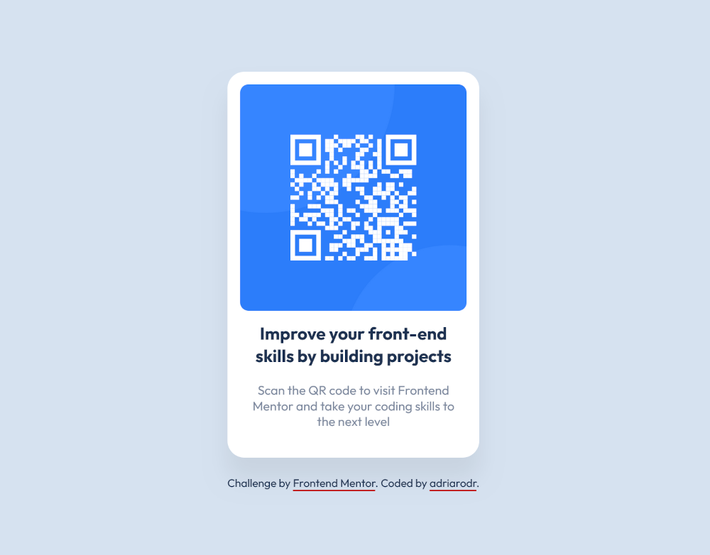

# Frontend Mentor - QR code component solution

This is a solution to the [QR code component challenge on Frontend Mentor](https://www.frontendmentor.io/challenges/qr-code-component-iux_sIO_H). Frontend Mentor challenges help you improve your coding skills by building realistic projects.

## Table of contents

- [Overview](#overview)
  - [Screenshot](#screenshot)
  - [Links](#links)
- [My process](#my-process)
  - [Built with](#built-with)
  - [What I learned](#what-i-learned)
  - [Useful resources](#useful-resources)
- [Author](#author)
- [Acknowledgments](#acknowledgments)

## Overview

### Screenshot

### Links

- Solution URL: [Add solution URL here](https://your-solution-url.com){:target="_blank"}
- Live Site URL: [Add live site URL here](https://adriarodr.github.io/qr-code-component/){:target="_blank"}

## My process

### Built with

- Semantic HTML5 markup
- Mobile-first workflow

### What I learned

During the challenge, I realized that screen readers couldn’t interpret the QR code on the website directly. So, my solution was to add a corresponding anchor that would take users to the same link when clicked on instead of relying solely on the QR code. Additionally, I added text within the paragraph that the user can use a QR code or link on the code to go to Frontend Mentor’s home page. Next, I made the link and additional text visually hidden by following CSS Tricks' visually hidden styling rule. While this challenge was simple, I was conscious of accessibility and what items I must implement to ensure the content makes sense to everyone.

### Useful resources

- [CSS Tricks - Inclusively Hidden](https://css-tricks.com/inclusively-hidden/){:target="_blank"} - This resource offers a quick overview of various methods to hide content and provides style rules for sr-only or visually-hidden classes.

- [Scott Hara - Inclusively Hidden](https://www.scottohara.me/blog/2017/04/14/inclusively-hidden.html){:target="_blank"} - This resource delves deeper into the reasons developers hide content and provides solutions. It is the original source for the Inclusively Hidden article by CSS Tricks.

## Author

- Website - [adriarodr's GitHub](https://github.com/adriarodr){:target="_blank"}
- Frontend Mentor - [@adriarodr](https://www.frontendmentor.io/profile/adriarodr){:target="_blank"}

## Acknowledgments

I would like to express my gratitude to CSS Tricks and Scott Hara for their informative articles on visually hiding content. Their articles have been very helpful.